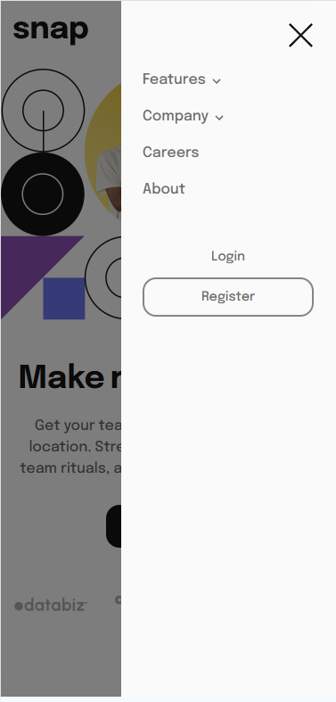
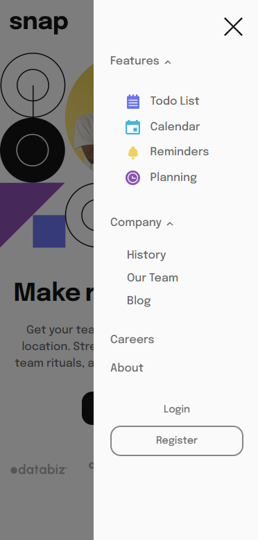

# Frontend Mentor - Intro section with dropdown navigation solution

This is a solution to the [Intro section with dropdown navigation challenge on Frontend Mentor](https://www.frontendmentor.io/challenges/intro-section-with-dropdown-navigation-ryaPetHE5). Frontend Mentor challenges help you improve your coding skills by building realistic projects.

Although it wasn't requested, I added display for tablets in addition to desktop and phone.
Being used to using React JS, I did this challenge to review the Javascript Vanilla language.

## Table of contents

- [Frontend Mentor - Intro section with dropdown navigation solution](#frontend-mentor---intro-section-with-dropdown-navigation-solution)
  - [Table of contents](#table-of-contents)
  - [Overview](#overview)
    - [The challenge](#the-challenge)
    - [Screenshot](#screenshot)
    - [Links](#links)
  - [My process](#my-process)
    - [Built with](#built-with)
  - [Author](#author)

## Overview

### The challenge

Users should be able to:

- View the relevant dropdown menus on desktop and mobile when interacting with the navigation links
- View the optimal layout for the content depending on their device's screen size
- See hover states for all interactive elements on the page

### Screenshot

Desktop 1440x900px : 

Mobile 375x780px :

### Links

- Solution URL: [Add solution URL here](https://github.com/GuilhemJoly/intro-section-with-dropdown-navigation-main)
- Live Site URL: [Add live site URL here](https://intro-section-with-dropdown-navigation-main-eta-lovat.vercel.app/)

## My process

### Built with

- Semantic HTML5 markup
- CSS custom properties
- Flexbox
- JS Vanilla

## Author

- Website - [Guilhem Joly](https://guilhemjoly.vercel.app/)
- Frontend Mentor - [@GuilhemJoly](https://www.frontendmentor.io/profile/GuilhemJoly)
- Twitter - [@GuilhemJoly](https://x.com/GuilhemJoly)
